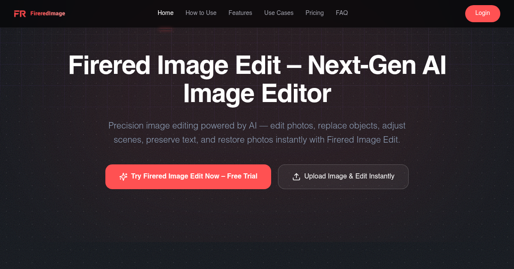

# FireRed Image Edit

> Next-Gen AI Image Editor - Remove objects, Replace backgrounds, Edit text, Enhance images

## Overview

[FireRed Image Edit](https://fireredimage.me) is a powerful AI-powered image editing platform that enables professional-grade photo manipulation in seconds.

## Key Features

- **Object Removal** - Seamlessly remove unwanted objects with [FireRed Image Edit](https://fireredimage.me)
- **Background Replacement** - Replace backgrounds instantly
- **Text Editing** - Edit text directly inside images
- **Image Enhancement** - Improve resolution and restore photos
- **Portrait Editing** - Professional portrait retouching
- **Multi-Image Fusion** - Combine multiple images

## Quick Start

Get started with [FireRed Image Edit](https://fireredimage.me) in 3 simple steps:

1. Visit [https://fireredimage.me](https://fireredimage.me)
2. Upload your image and describe your edit
3. Download your edited image

## Use Cases

### E-Commerce Product Photography
Create high-converting product images with [FireRed Image Edit](https://fireredimage.me).

### Social Media Content
Design scroll-stopping visuals for Instagram, TikTok, and ads.

### Photo Restoration
Restore old, blurry, or damaged photos with AI precision.

## Links

- **Website**: [https://fireredimage.me](https://fireredimage.me)
- **Try Now**: [FireRed Image Edit - AI Image Editor](https://fireredimage.me)

## License

MIT License - see [LICENSE](LICENSE) file.

---

**Start editing your images today with [FireRed Image Edit](https://fireredimage.me)!**
